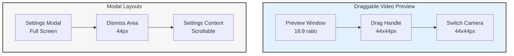
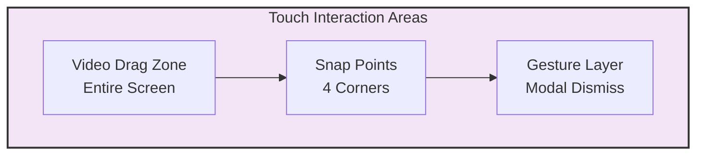

# Mobile Layout Structure

```mermaid
graph TB
    subgraph viewport[Viewport Mobile 360-428px]
        subgraph header[Header Row - 60px]
            disconnect[Disconnect<br/>44x44px] -->|Left| header
            audioswitch[Audio/Text<br/>44x44px] -->|Right| header
        end
        
        subgraph chatarea[Chat Display Area - 40vh min]
            messages[Message Bubbles<br/>16px padding] --> chatarea
            scroll[Scroll Area] --> chatarea
        end
        
        subgraph visualizer[Audio Visualizer - 80px]
            waves[Wave Animation] --> visualizer
        end
        
        subgraph controls[Control Banner - 72px]
            camera[Camera<br/>56x56px] --> controls
            screen[Screen<br/>56x56px] --> controls
            mic[Mic<br/>56x56px] --> controls
            settings[Settings<br/>56x56px] --> controls
        end
        
        subgraph input[Input Area - 60px]
            textbox[Text Input<br/>44px height] -->|Flexible| input
            send[Send<br/>44x44px] -->|Fixed| input
        end
        
        header --> chatarea
        chatarea --> visualizer
        visualizer --> controls
        controls --> input
    end
    
    style viewport fill:#f9f9f9,stroke:#333,stroke-width:2px
    style header fill:#e3f2fd,stroke:#333
    style chatarea fill:#ffffff,stroke:#333
    style visualizer fill:#f5f5f5,stroke:#333
    style controls fill:#e3f2fd,stroke:#333
    style input fill:#f5f5f5,stroke:#333
```

## Floating Elements



## Touch Interaction Zones



Notes:
- All measurements in logical pixels
- Touch targets maintain minimum size across layouts
- Spacing adjusted for optimal touch interaction
- Modal layers respect safe areas